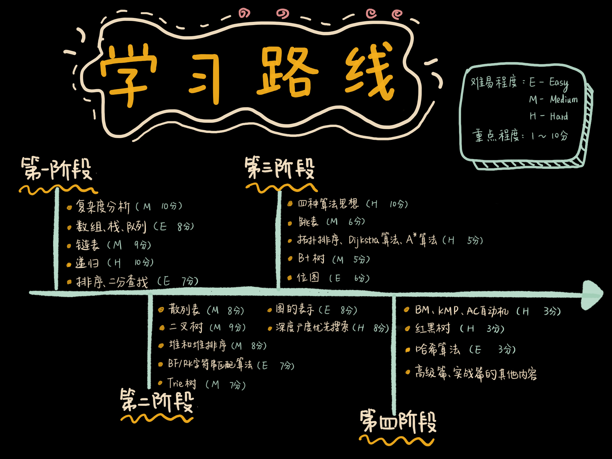
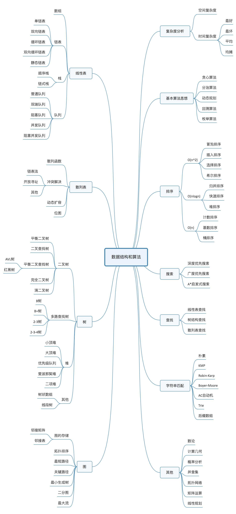

## 课程主页：https://time.geekbang.org/column/article/39922
## 课程学习路线：

## 思维导图：

## 课程结构：
- 复杂度分析
  - 空间复杂度
  - 时间复杂度
    - 最好
    - 最坏
    - 平均
    - 均摊
- 基本算法思想
  - 穷举
  - **分治**
  - **贪心**
  - **动态规划**
  - **回溯**
- 线性表
  - **数组**
  - **链表**
    - 单链表
    - 双向链表
    - 循环链表
    - 双向循环链表
    - 静态链表
  - **队列**
    - 普通队列
    - 双链队列
    - 阻塞队列
    - 并发队列
    - 阻塞并发队列
  - **栈**
    - 顺序栈
    - 链式栈
- **散列表**
  - **散列函数**
  - 冲突解决
    - 链表法
    - 开放寻址
    - 其他
  - 动态扩容
  - 位图
- 树
  - **二叉树**
    - 平衡二叉树
    - 二叉查找树
    - 平衡二叉查找树
      - AVL树
      - 红黑树
    - 完全二叉树
    - 满二叉树
  - 多路查找树
    - B树
    - B+树
    - 2-3树
    - 2-3-4树
  - **堆**
    - 小顶堆
    - 大顶堆
    - 优先级队列
    - 斐波那契堆
    - 二项堆
  - 其他
    - 树状数组
    - 线段树
- **图**
  - 图的存储
    - 邻接矩阵
    - 邻接表
  - 拓扑排序
  - 最短路径
  - 关键路径
  - 最小生成树
  - 二分图
  - 最大流
- **排序**
  - O(n^2)
    - 冒泡
    - 插入
    - 选择
    - 希尔
  - O(nlogn)
    - 归并排序
    - 快速排序
    - 堆排序
  - O(n)
    - 基数排序
    - 计数排序
    - 桶排序
- **搜索**
  - 深度优先搜索
  - 广度优先搜索
   A\*启发式搜索
- **查找**
  - 线性表查找
  - 树结构查找
  - 散列表查找
- **字符串匹配**
  - 朴素
  - KMP
  - Robin-Karp
  - Boyer-Moore
  - AC自动机
  - **Trie**
  - 后缀数组
- 其他
  - 数论
  - 计算几何
  - 概率分析
  - 并查集
  - 拓扑网络
  - 矩阵运算
  - 线性规划
## 敲黑板，划重点
- 10个重要的数据结构：数组、链表、栈、队列、散列表、二叉树、堆、跳表、图、Trie树；
- 10个重要的算法：递归、排序、二分查找、搜索、哈希算法、贪心算法、分治算法、回溯算法、动态规划、字符串匹配算法
## 推荐书单
- 针对入门的趣味书
  - 《大话数据结构》：400多页，结合生活中的例子对每个数据结构和算法进行了讲解
  - 《算法图解》：不到200页像小说一样的算法入门书
- 针对特定编程语言的教科书
  - 《数据结构与算法分析 ：C语言描述》
  - 《数据结构与算法分析：C++描述》
  - 《数据结构与算法分析 ：Java语言描述》
  - 《数据结构与算法 JavaScript 描述》
  - 《数据结构与算法：Python 语言描述》
- 面试必刷宝典
  - 《剑指offer》：几乎包含了所有常见的、经典的面试题
  - 《编程珠玑》：有很多针对海量数据的处理技巧
  - 《编程之美》：质量很高，题目稍难
- 经典书籍
  - 《算法导论》：章节安排不是循序渐进的，里面充斥着各种算法的正确性、复杂度的证明推导，数学公式比较多
  - 《算法》：偏重讲算法，内容不够全面
  - 《计算机程序设计艺术》：殿堂级经典书，其深度、广度、系统性、全面性是其他所有数据结构和算法书籍都无法比拟的
- 闲暇阅读
  - 《算法帝国》
  - 《数学之美》
  - 《算法之美》

