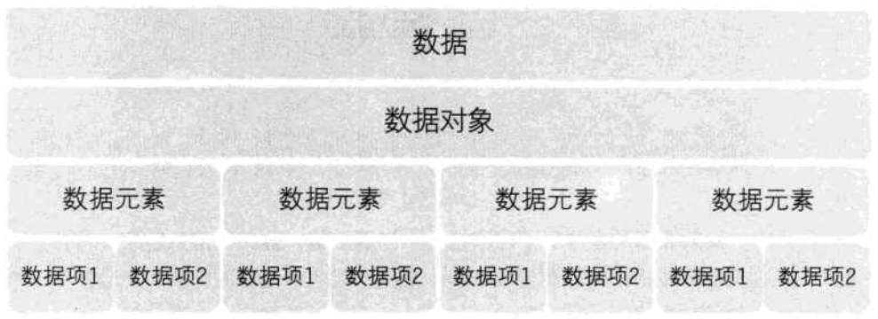
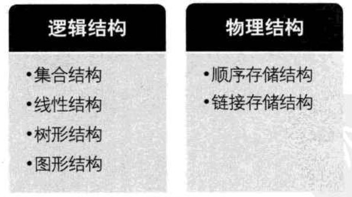

## 数据结构定义

- 数据结构是一门研究非数值计算的程序设计问题中的操作对象，以及它们之间的关系和操作等相关问题的学科。
- 数据结构阐述了**数据的逻辑结构和存储结构及其操作**。
- 程序设计的实质：对确定的问题选择一种好的结构，加上设计一种好的算法。
- **程序设计=数据结构+算法**
- 基本概念和术语
  - 数据：描述客观事物的符号，是计算机中可以操作的对象，是能被计算机识别，并输入给计算机处理的符号集合。包括整型、实数型等数值类型，还包括声音、图像视频等非数值类型。
  - 数据元素：组成数据的、有一定意义的基本单位，在计算机中通常作为整体处理。
  - 数据项：一个数据元素可以由若干个数据项组成。数据项是数据不可分割的最小单位。
  - 数据对象：性质相同的性质元素的集合，是数据的子集。
  - 数据结构：不同数据元素之间不是独立的，而是存在特定的关系，我们把这些关系称为结构。而数据结构就是**相互之间存在一种或多种特定关系的数据元素的集合**。

## 逻辑结构与物理结构
- 数据结构分为逻辑结构和物理结构。
- 逻辑结构：**数据对象中数据元素之间的相互关系**。
  - 集合结构：数据元素同属于一个集合。
  - 线性结构：数据元素是一对一的关系。
  - 树形结构：数据元素之间存在一种一对多的层次关系。
  - 图形结构：数据元素是多对多的关系。
- 物理（存储）结构：**数据的逻辑结构在计算机中的存储形式**。
  - 关键：**数据的存储形式应该正确反映数据元素之间的逻辑关系**。如何存储数据元素之间的逻辑关系，是实现物理结构的重点和难点。
  - 数据元素的存储结构形式有两种：顺序存储和链式存储。
    - **顺序存储结构**：将数据元素存放在地址连续的存储单元里，其数据间的逻辑关系和物理关系是一致的。如数组。
    - **链式存储结构**：将数据元素存放在任意的存储单元内，这组存储单元可以是连续的，也可以是不连续的。数据元素的存储关系不反应其逻辑关系，使用一个指针存放数据元素的地址，这样通过地址就可以找到相关联数据元素的位置。

## 抽象数据类型

- 数据类型
  - 定义：**一组性质相同的值的集合及定义在此集合上的一些操作的总称**。
  - 如每个变量、常量和表达式都有各自的取值范围，数据类型用来说明变量或表达式的取值范围和所能进行的操作。
- 抽象数据类型（abstract data type, ADT）
  - 定义：指一个数学模型及定义在该模型上的一组操作。
  - 抽象的意义在于数据类型的数学抽象特性。
  - 抽象数据类型体现了程序设计中问题分解、抽象和信息隐藏的特性。
  - 数据对象、数据对象中各元素之间的关系、对数据元素的操作，如整型。
  - 描述抽象数据类型的标准形式：
  ```
  ADT 抽象数据类型名
  Data
      数据元素之间逻辑关系的定义
  Operation
      操作1
          初始条件
          操作结果描述
      操作2
          ......
      操作n
          ......
  endADT
  ```
  ## 总结
  - 数据结构的相关概念：
  
  - 数据结构的定义：相互之间存在一种或多种特定关系的数据元素的集合。
  - 数据结构的分类：
  
  - 抽象数据类型及其描述方法
