## 线性表的定义

- **线性表（List）：零个或多个数据元素的有限序列**。
- 元素之间存在顺序。若存在多个元素，则第一个元素无前驱，最后一个元素无后继，其他元素有且只有一个前驱和后继。
- 记法：若将线性表记为(a1,...,a_i-1,a_i,a_i+1,...,a_n)，则称a_i-1是a_i的直接前驱元素，a_i+1是a_i的直接后继元素。当i=1,2,...,n-1时，a_i有且仅有一个直接后继，当i=2,3,...,n时，a_i有且仅有一个直接前驱。
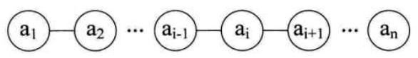
- 线性表元素的个数n(n>=0)定义为线性表的长度，当n=0时，称为空表。

## 线性表的抽象数据类型(Abstract Ddat Type)

- 线性表的基本操作
```
ADT List:
   List(self)           #创建一个新表
   is_empty(self)       #判断self是否是一个空表
   len(self)            #返回表长度
   prepend(self,elem)   #在表头插入元素
   append(self,elem)    #在表尾加入元素
   insert(self,elem,i)  #在表的位置i处插入元素
   del_first(self)      #删除第一个元素
   def_last(self)       #删除最后一个元素
   del(self,i)          #删除第i个元素
   get(self,i)          #获取第i个元素
   search(self,elem)    #查找元素在表中第一次出现的位置
   forall(self,op)      #对表元素的遍历操作，op操作
```

- 实现两个线性表集合A和B的并集操作
```
def union(a, b):
    ```将所有在线性表Lb中但不在La中的数据元素插入到La中```
    l_a = len(a)
    l_b = len(b)
    for i in range(l_b):
        x = b.get(i)
        if a.count(x) == 0:
            a.insert(x, l_a)
            l_a += 1
    return a
```

## 线性表的顺序存储结构

- 定义：**用一段地址连续的存储单元依次存储线性表的数据元素。**
- 顺序存储方式
    - **使用一维数组来实现顺序存储结构**
    - 顺序存储的结构代码：
    ```
    #define MAXSIZE 20           /*存储空间初始分配量*/
    typedef int ElemType;        /*ElemType类型根据实际情况而定，这里假设为int*/
    typedef struct
    {
        ElemType data[MAXSIZE];  /*数组存储数据元素，最大值为MAXSIZE*/
        int length;              /*线性表当前长度*/
    }SqList;
    ```
    - 顺序存储结构需要的三个属性：
        - 1.存储空间的起始位置：数组data的存储位置就是存储空间的存储位置
        - 2.线性表的最大存储容量：数组长度Maxsize
        - 3.线性表的当前长度：length
- 数组长度与线性表长度
    - 数组长度：存放线性表的存储空间的长度，存储分配后这个量一般是不变的。
    - 线性表长度：线性表中数据元素的个数，随着线性表插入和删除操作而变化
    - 在任意时刻，线性表的长度应该小于等于数组的长度
- 线性表的地址计算方法
    - 由于数组下标从0开始，第i个元素存储在数组的下标为i-1的位置
    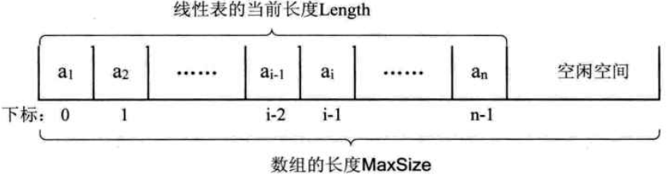
    - **存储器中的每个存储单元都有自己的编号，这个编号称为地址。**
    - 地址计算方式：假设每个数据元素占用c个存储空间
        - `Loc(a_i+1) = Loc(a_i) + c`
        - `Loc(a_i) = Loc(a1) + (i-1) \* c`

- 顺序存储结构的操作

由于Python内部的tuple和list采用的就是顺序存储结构,不同点在于tuple是固定结构,list是可变动结构,具有线性表ADT描述的全部操作,这里只列举列表list的对象方法:

|方法|说明|
|--|--|
|list.append(x)|在列表末尾添加元素,相当于a[len(a):] = [x]|
|list.extend(iterable)|使用可迭代对象的所有元素来扩展列表,相当于a[len(a):] = x|
|list.insert(i, x)|在指定位置插入元素x,在列表头部插入x是a.insert(0, x),在列表尾部插入x是a.insert(len(a), x),相当于a.append(x)|
|list.remove(x)|移除列表中第一个值为x的元素.如果没有这样的元素,则抛出ValueError异常.|
|list.pop([i])|删除列表中给定位置的元素并返回它.默认删除并返回列表中的最后一个元素.|
|list.clear()|删除列表中所有的元素,相当于del a[:]|
|list.index(x[, start[, end]])|返回列表中第一个值为x的元素从;零开始的索引.如果没有这样的元素,则抛出ValueError异常.start和end可用于限制搜索范围.|
|list.count(x)|返回元素x在列表中出现的次数.|
|list.sort(key=None, reverse=False)|对列表中的元素进行排序|
|list.reverse()|反转列表中的元素|
|list.copy()|返回列表的一个浅拷贝,相当于a[:]|
|||

- 不同操作的时间复杂度:

|操作|时间复杂度|
|--|--|
|append()|O(1)|
|insert(i,x)|O(n)|
|remove(x)|O(n)|
|pop([i])|指定i时为O(n),不指定时为O(1)|
|index(x)|O(n)|
|count(x)|O(n)|
|||

- 优点：
  - 无须为表示表中元素之间的逻辑关系而增加额外的存储空间
  - 可以快速的存取表中任一位置的元素
- 缺点：
  - 插入和删除操作需要移动大量元素
  - 当线性表长度变化较大时，难以确定存储空间的容量
  - 容易造成存储空间的“碎片”
 
## 线性表的链式存储结构
 
- 定义：用一组任意的存储单元存储线性表的数据元素。
  - 对ai来说，除了存储本身的信息之外，还需要存储其直接后继的存储位置。我们将存储数据元素信息的域称为数据域，将存储直接后继位置的域称为指针域。这两部分信息构成了数据元素ai的存储影像，称为结点(Node)。
  - n个结点构成一个链表，即为线性表的链式存储结构。因为此链表的每个结点只包含一个指针域，所以叫做单链表。单链表通过每个结点的指针域将线性表的数据元素按照其逻辑次序链接在一起。
  - 我们将链表中第一个结点的存储位置叫做头指针，后面的每一个结点都是前一个结点的后继指针指向的位置。而最后一个子结点指针为空。
  - 有时，为了方便对链表进行操作，会在单链表的第一个结点前附设一个结点，称为头结点。头结点的数据域可以不存储任何信息，也可以存储如线性表的长度等附加信息。头结点的指针域存储指向第一个结点的指针。
- 头指针与头结点的区别
  - 头指针是链表的必要元素，是链表指向第一个结点的指针，具有标识作用，常用于表示链表的名字。
  - 头结点是为了操作的统一和方便而设立的、放在第一元素的结点之前。头结点的指针域存储指向第一个结点的指针。有了头结点，对在第一元素之前插入结点和删除第一结点，其操作与其他结点的操作就统一了。
- 单链表结构：
  - 不带头结点的单链表：
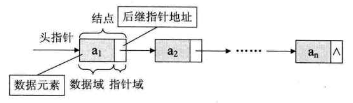
  - 带有头结点的单链表：
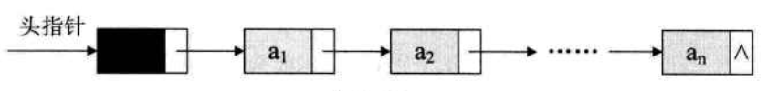

- 单链表的实现:见`03LinkedList.py`中的`LinkedList`类.

- 单链表的改造
    - 传统的单链表访问尾结点的时间复杂度为O(n),为了同时便于访问头结点和尾结点,可以添加一个指向尾结点的尾指针rear.实现见`03LinkedList.py`中的`_LinkedList`类.

- 链式存储结构与顺序存储结构的比较

    - 存储分配方式
        - 顺序存储结构用一段连续的存储单元依次存储线性表的数据元素
        - 单链表采用链式存储结构，用一组任意的存储单元存放线性表的元素
    - 时间性能
        - 查找
            - 顺序存储结构O(1)
            - 单链表O(n)
        - 插入和删除
            - 顺序存储结构需要平均移动表长一半的元素，时间为O(n)
            - 单链表得到某结点的指针后，插入和删除时间仅为O(1)
    - 空间性能
        - 顺序存储结构需要预分配存储空间，分大了浪费，分小了容易发生上溢
        - 单链表不需要分配存储空间，元素个数不受限制
    - 结论：
        - 对于需要频繁查找、很少进行插入和删除操作的线性表来说，宜采用顺序存储结构；若需要频繁插入和删除，宜采用单链表结构。
        - 当线性表的元素个数变化较大或者不知道有多大时，宜采用单链表结构；若事先知道线性表的大致长度，宜采用顺序存储结构。

## 静态链表 (static linked list)

- 定义：对于早期的高级编程语言，没有指针的存在，人们使用数组代替指针来描述单链表。数组的每个下标对应一个data和cur。数据域data用来存放数据元素，游标cur相当于单链表中的next指针，存放该元素的后继在数组中的下标。我们把用数组描述的链表叫做静态链表。
- 存储结构：
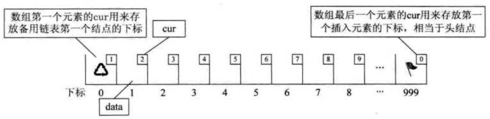
- 实现:见`03LinkedList.py`中的`StaticLinkedList`类.
- 优缺点：

## 循环链表（circular linked list）
- 定义：将单链表中终端结点的指针由空指针改为指向头结点，使整个单链表形成一个环，这种头尾相接的单链表称为单循环链表，简称循环链表（circular linked list）。
- 循环链表使得可以从任意一个结点出发，访问到链表的全部结点。
- 带头指针的非空循环链表结构:
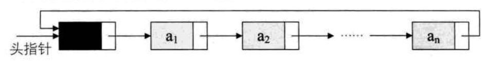
- 循环链表和单链表的差异：
    - 两者对于循环的判断条件不同。单链表若`p->next`为空，则循环结束；循环链表若`p->next`不等于头结点，则循环未结束。
- 循环链表的改造:
    - 改造循环链表，不用头指针，而是用指向终端结点的尾指针`rear`来表示循环链表，此时用`rear->next->next`查找开始结点,用`rear`查找终端结点，时间复杂度都为`O(1)`。
    - 改造得到的带尾指针的非空循环链表结构:
    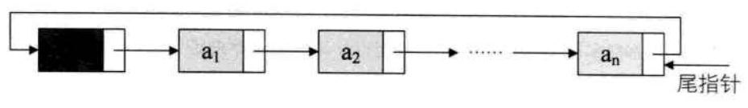
    - 实现:见`03LinkedList.py`中的`CirLinkedList`类.
- 合并两个循环链表
    - 对循环链表加入尾指针后,很方便对多个循环链表进行合并,合并两个循环链表的操作示意图如下:
    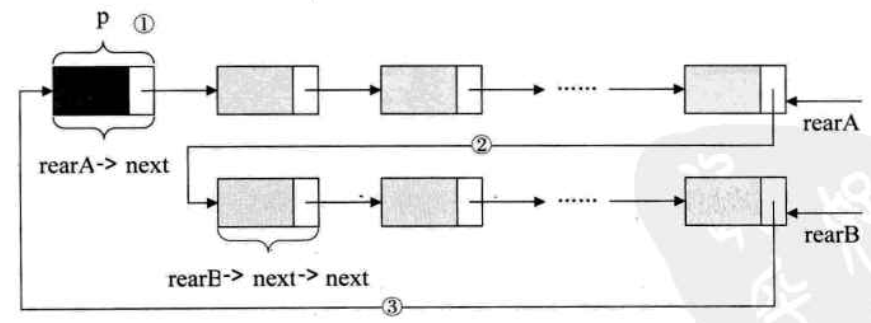
    - 假设两个循环链表的尾指针为rearA和rearB,则合并操作如下,实现见`03LinkedList.py`中的`CirLinkedList`类中的`concated`方法.
    ```
    p = rearA->next;
    rearA-next = rearB->next->next;
    rearB->next = p;
    free (p);
    ```
## 双向链表（double linked list）

- 定义：在单链表的每个结点中，再设置一个指向其前驱结点的指针域prior。
- 结构：
    - 带头结点的双向循环空链表:
    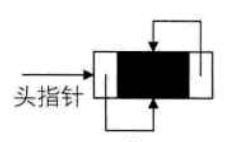
    - 非空的循环的带头结点的双向链表
    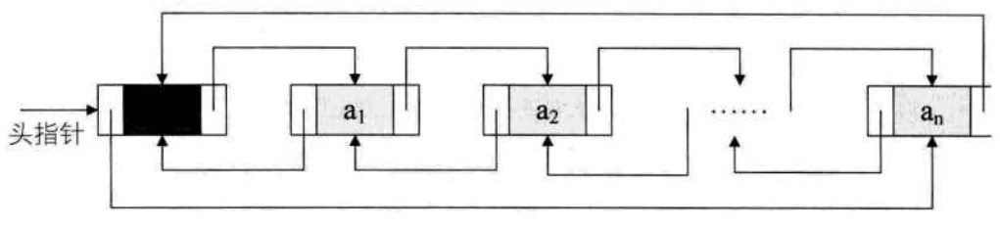
- 与单链表的比较
    - 求链表长度,查找元素,获取元素位置等方法与单链表相同
    - 插入和删除操作需要更改两个指针变量
- 插入操作示意图:
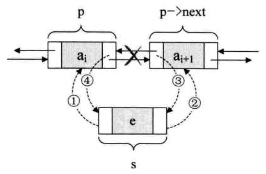
- 删除操作示意图:
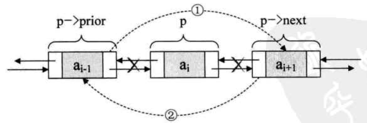
- 实现:见`03LinkedList.py`中的`DoubleLinkedList`类.

## 总结
- 线性表的定义
- 线性表的抽象数据类型
- 顺序存储结构
- 链式存储结构
    - 单链表
    - 静态链表
    - 循环链表
    - 双向链表