# 栈与队列

## 栈(stack)的定义
- 例子
    - 弹夹式手枪压入子弹
    - 浏览器后退键
    - 文档图像软件中的撤销操作
- 定义
    - 定义:**栈(stack)是限定只在表尾进行插入和删除操作的线性表**
    - 允许插入和删除的一端称为栈顶(top),另一端称为栈底(bottom),不含任何数据元素的栈称为空栈.
    - 栈又称为后进先出(Last In First Out)的线性表,简称LIFO结构.
- 注意点
    - 栈首先是一个线性表,栈中的元素具有线性关系,即前驱后继关系.
    - 栈是一种特殊的线性表,只在线性表的表尾进行插入和删除操作,这里的表尾指的是栈顶,不是栈底.
    - 栈限制了线性表的插入和删除位置,只在栈顶进行.则:栈底是固定的,最先进栈的元素存在栈底.
    - **栈的插入操作,叫做进栈,也叫压栈,入栈;**
    - **栈的删除操作,叫做出栈,也叫弹栈.**

    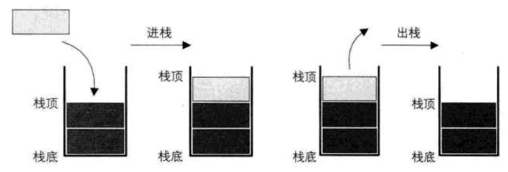

- 进出栈顺序:有3个整型数字元素1,2,3依次进栈,求可能的出栈顺序
|进出栈操作|出栈顺序|
|--|--|
|1,2,3进,3,2,1出|321|
|1,2进,2,1出,3进3出|213|
|1,2进,2出,3进,31出|231|
|1进,1出,23进,32出|132|
|1进,1出,2进,2出,3进,3出|123|

3个元素存在5种可能的出栈顺序,除了312不可能外,其余顺序都有可能.

## 栈的抽象数据类型
```
ADT stack
    stack(self)            # 创建一个新的空栈
    is_empty(self)         # 判断栈是否为空
    destroy_stack(self)    # 若栈存在,则销毁它
    clear_stack(self)      # 若栈存在,清空栈中元素
    get_top(self)          # 若栈存在且非空,获取栈顶元素
    push(self, elem)       # 若栈存在且非满,新元素入栈
    pop(self)              # 若栈存在且非空,栈顶元素出栈
    len(self)              # 若栈存在,返回元素个数
```

## 栈的顺序存储
- 栈的顺序存储结构
    - 线性表使用一维数组实现顺序存储,我们将数组下标为0的一端作为栈底,定义一个top变量来标记栈顶元素在数组中的位置,
    - 假设存储栈的长度为stacksize,则top的取值范围为[-1,stacksize).`top = -1`表示栈为空,`top = 0`说明栈只存在一个元素,`top = stacksize-1`说明栈满.对于stacksize=5的栈的存储情况如下所示:

    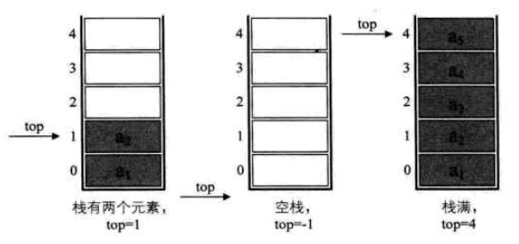

- 进栈
    - 若栈存在且未满,栈顶指针加1,将新元素赋值给栈顶空间.
    - S -> top ++, S -> data[S -> top] = elem.
    ```
    def push(stack, elem):
        if not stack:
            print('there is no existing Stack named stack')
            return Error
        if stack.top == len(stack) - 1:
            print('the stack is full')
            return Error
        stack.top += 1
        stack.data[stack.top] = elem
        return OK
    ```
- 出栈
    - 若栈存在且不为空,返回要删除的栈顶元素,栈顶指针减1
    - e = S -> data[S -> top], S -> top --.
    ```
    def pop(stack):
        if not stack:
            print('there is no existing Stack named stack')
            return Error
        if stack.top == -1:
            print('the stack is null')
            return Error
        elem = stack.data[stack.top]
        stack.top -= 1
        return elem
    ```
- 两栈共享空间
    - 动机:对于栈的顺序存储结构来说,其数组存储空间大小难以确定,**对于两个相同类型的栈,我们可以使用一个共享数组存储了两个栈.**
    - 做法:将数组的两端分别作为两个栈的栈底,两个栈如果增加元素,就从两端向中间延伸.
    - 假设数组长度为n,top1和top2分别为两个栈的栈顶指针.当`top1=-1`时栈1为空,当`top2=n`时栈2为空,当`top1 + 1 == top2`时,栈满.
    - 两栈共享空间类
    ```
    class SqDoubleStack:
        def__init__(self, maxsize):
            self.data = []
            self.top1 = -1
            self.top2 = maxsize
            self.maxsize = maxsize

        def push(self, elem, stack_num):
            if self.top1 + 1 == self.top2:
                raise ValueError
            if stack_num == 1:
                self.top1 += 1
                self.data[self.top1] = elem
            elif stack_num == 2:
                self.top2 -= 1
                self.data[self.top2] = elem

        def pop(self, stack_num):
            if stack_num == 1:
                if self.top1 == -1:
                    raise ValueError
                elem = self.data[self.top1]
                self.top -= 1
            elif stack_num == 2:
                if self.top2 == self.maxsize:
                    raise ValueError
                elem = self.data[self.top2]
                self.top2 += 1
    ```
    - 总结:当两个栈的数据类型相同,且空间需求有相反作用时,通常使用两栈共享的空间存储方法才有比较大的意义.

## 栈的链式存储
- 栈的链式存储结构
    - **栈的链式存储结构,简称为链栈**
    - 将单链表的头指针和栈的栈顶指针合二为一,去掉单链表中常用的头结点,形成了下图的结构:

    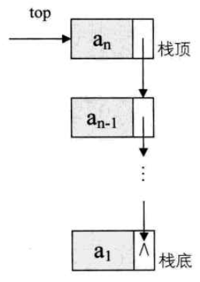

    - 链栈类实现
    ```
    # 单链表结点类
    class Node:
        def __init__(self, value, next = None):
            self.val = value
            self.next = next

    class LinkedStack:
        def __init__(self):
            self.top = None
            self.num = 0

        def is_empty(self):
            return self.top is not None

        def push(self, elem):
            s = Node(elem)
            if self.top == None:
                self.top = s
            else:
                s.next = self.top
                self.top = s
            self.num += 1

        def pop(self):
            if self.num == 0:
                raise ValueError
            elem = self.top.val
            self.top = self.top.next
            self.num -= 1
            return elem  
    ```
    - 顺序栈和链栈的比较
        - 时间复杂度都为O(1)
        - 空间性能
            - 顺序栈需要事先确定一个固定长度,可能存在内存浪费,优势是存取时定位很方便
            - 链栈的每个元素都有指针域,增加了内存开销,但对于栈的长度无限制
        - 结论:**如果栈的使用过程中元素变化不可预料,使用链栈,反之使用顺序栈.**

## 栈的应用----递归
- 使用递归实现斐波那契数列
```
def Fbi(i):
    if i < 2:
        return i == 0 ? 0 : 1
    return Fbi(i - 1) + Fbi(i - 2)
def main():
    for i in range(40):
        print(Fbbi(i))
```
- 注意:**每个递归定义必须至少满足一个条件,使得条件满足时递归不再进行,即不在引用自身而是返回值并退出**
- 迭代与递归的区别:
    - 迭代使用循环结构,不需要反复调用函数占用额外的内存.
    - 递归使用选择结构,使程序更容易理解,但是大量的递归调用会建立函数的副本,会耗费大量的时间和内存.

## 栈的应用----四则运算表达式求值

## 队列的定义
- 例子
    - 操作系统
    - 客服系统
- 定义
    - 定义:**队列(queue)是只允许在一段进行插入操作,而在另一端进行删除操作的线性表.**
    - 队列是一种先进先出(First In First Out)的线性表,简称为FIFO.
    - 队列允许插入的一端称为队尾,允许删除的一端称为队头.
    - 队列的插入操作叫做入队列,删除操作叫做出队列.
    - 队列q=(a1,a2,a3,...,an)
    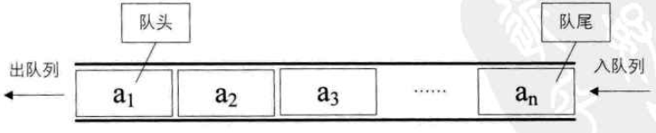

- 队列的抽象数据类型
```
ADT queue
    __init__(self, maxsize)
    get_length(self)
    destory(self)
    clear(self)
    is_empty(self)
    insert(self, elem)
    del(self)
    get_head(self)
    
```

## 循环队列
- 队列的顺序存储结构
    - 对于有n个元素的队列,我们使用长度大于n的数组进行顺序存储,把队列的所有元素存储在数组的前n个单元,数组下标为0的一端即为队头.
    - 入队列操作:在队尾追加一个元素,时间复杂度O(1)
    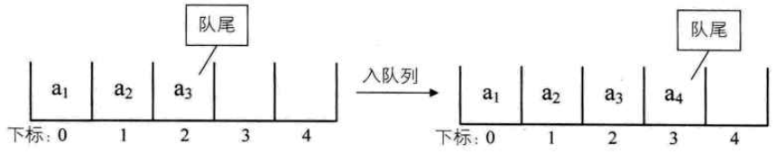
    - 出队列操作:弹出数组下标为0位置的元素,其余元素向前移动,时间复杂度为O(n)
    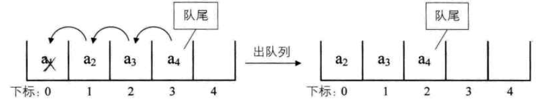
    - 为了克服顺序存储的队列出队时的复杂操作,我们对队头的位置不做限定.同时引入两个指针,front指向队头元素,rear指向队尾元素.
    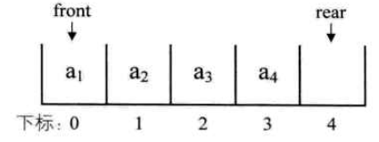
- 循环队列
    - 定义:头尾相接的顺序存储的队列称为循环队列
    - 空循环队列:front == rear
    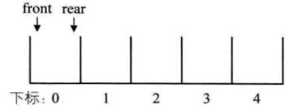
    - 满循环队列:(rear+1)%queuesize == front
    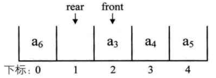
    - 队列长度计算公式:`(rear-front+queuesize)%queuesize`,取值范围为`[0,queuesize)`
- 循环队列类的实现:Queue.py中的SqQueue类

## 队列的链式存储结构及实现
- **队列的链式存储结构,就是线性表的单链表,限制只能尾部插入头部删除,简称为链队列.**
- 使用队头指针front指向链队列的头结点,队尾指针rear指向链队列的尾结点.
    - 非空队列:
    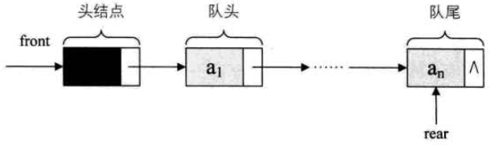
    - 空队列:
    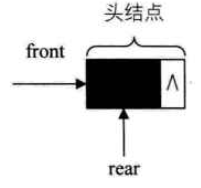
- 实现:Queue.py中的LinkedQueue类
- 循环队列与链队列的比较
    - 两者的基本操作时间复杂度都为O(1)
    - 循环队列事先申请好空间,使用期间不释放,存在存储元素个数和空间浪费的问题;链队列每次申请和释放结点存在一些时间开销
    - 总结:在可以确定队列长度最大值的情况下,建议使用循环队列,无法预估队列长度时使用链队列.

## 总结
- 栈(stack):仅在表尾进行插入和删除操作的线性表
    - 顺序栈:使用一维数组实现顺序存储,将下标为0的一端作为栈底,定义一个top变量来标记栈顶元素在数组中的位置
        - 两栈共享空间:对于两个相同数据类型的栈,可以使用数组的两端做栈底的方法来让两个栈共享数据
    - 链栈:将单链表的头指针head和栈的栈顶指针top合二为一,去掉单链表中常用的头结点
- 队列(queue):仅在表尾进行插入操作,在表头进行删除操作的线性表
    - 顺序队列:使用一维数组实现顺序存储,将下标为0的一端作为队头
        - 循环队列:引入front和rear两个指针,使得顺序队列头尾相接,解决了移动数据的时间损耗
    - 链队列:使用队头指针front指向链队列的头结点,队尾指针rear指向链队列的尾结点.